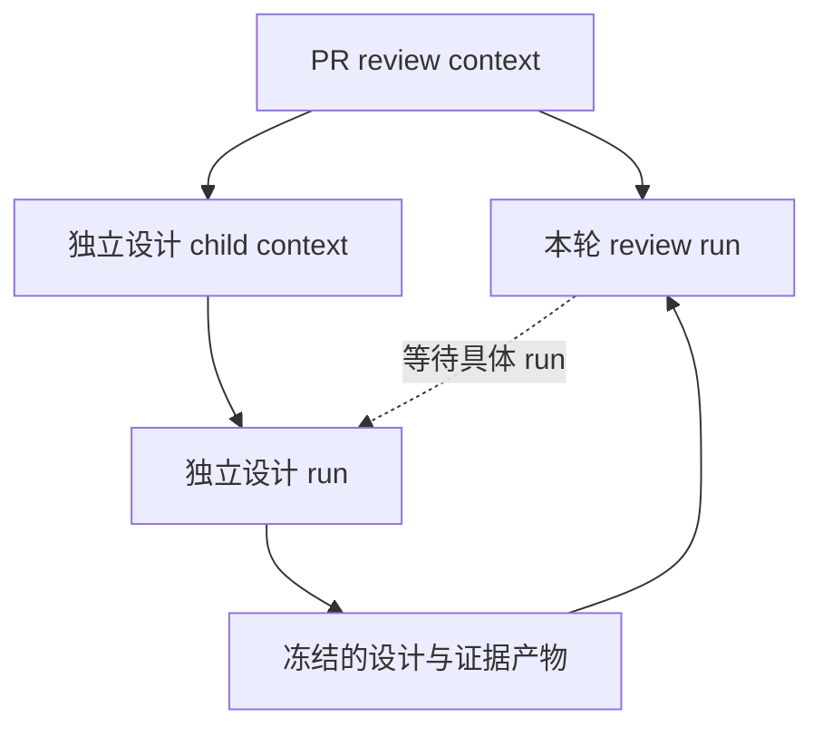
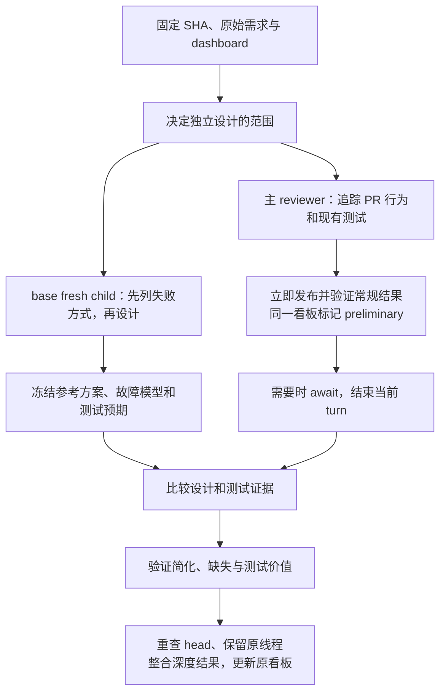

# Nyanpasu 独立设计、子任务与测试审查方案

状态：实现与评估方案，2026-09-25。通用子任务、根并发额度、级联回收、独立 base 快照、reviewer prompts、证据冻结和 Dashboard 已实现为四层 PR stack。reviewer 按常规审查与深度审查分阶段交付，常规结果不等待深度任务。本文保留完整设计依据；当前接口见下一节。尚未执行历史 PR 的模型盲评，也没有执行全仓测试质量审计。

## 当前实现入口

- 栈底到栈顶：`codex/subtask-state` → `codex/subtask-runtime` → `codex/review-reference` → `codex/subtask-dashboard`。
- `context_scopes` 是生命周期和资源归属的权威来源，`agent_contexts` 仍只保存原生会话和 workspace。`spawned_by_task_id` 管本轮执行派生关系，不复用 `coalesced_into`。
- 第一版子任务要求父任务已配置仓库 workspace；未配置时拒绝创建，避免共享服务自身的工作目录。
- CLI：`nyanpasu subtask CONTROL_FILE REQUEST_FILE`，或使用每轮指令给出的绝对 Python 命令。请求 JSON 的 `action` 为 `create`、`inspect`、`await`、`cancel`、`complete`；凭据由本地 Unix socket 校验，结束原生 turn 后撤销。
- 独立设计的真实创建格式见 reviewer 的 `instructions/review-planning.md`；运行时为 `independent-design` 请求覆盖 revision、workspace 模式和设计 prompt，固定共同起点。
- 创建子任务后主 reviewer 继续常规审查，先保存并发布 general 结果，再等待和整合 deep 证据。同一个 gh-slate 用 `stages.general`、`stages.deep` 分别展示范围与进度；`preliminary` 表示初步结果已交付，深度审查仍在进行。子任务失败不抹去已交付结果。顺序由 reviewer 指令要求，服务不代替模型发布。
- 父任务等待时同时保留根额度与 context lease。新事件可以入队；由同一锁和 lease 阻止它重置父 workspace。无需另建“逻辑队首”状态。
- 子任务资源路径使用唯一 context UUID；关闭后重开的根 context 可以重用路径，generation 与先停止后删除的协议阻止旧执行复活。
- `complete` 校验结构与 workspace 内文件路径，将证据复制到 `state_dir/artifacts/subtasks/` 并记录 SHA-256。每文件上限 10 MiB、每次最多 32 文件；下载时验证 digest。原生 transcript 继续是会话历史来源。
- Dashboard 展示父/子链接、等待对象、生命周期、结果和认证下载；运行时明确标注根任务并发语义。没有新增集群配额或模型用量归并平台。
- 基础运行时验证、定向缺陷实验和未验证项见 [validation](subtask-validation.md)。模型质量仍需下文的人工案例评估，不能由模板字串测试代替。

目标是让 reviewer 为设计判断和测试价值提供可复核的证据：在相同需求下，复杂度能否减少；真实缺陷出现时，测试能否发现；行为不变时，测试能否保持稳定。

## 1. 决策与边界

采用以下设计：

- 核心提供通用 subtask，复用现有任务、原生会话、workspace、数据库和调度器。
- agent 根据任务语义决定是否需要独立设计、验证实验或额外测试审查；reviewer 指令规定适用场景。用户明确要求的阶段必须执行。
- 系统强制保证父子归属、输入版本、幂等创建、等待恢复和级联回收。这些不能靠 agent 记得做。
- `runtime.concurrency` 限制同时进行的根任务执行；一个根任务及其全部后代共享一个额度，subtask 不单独占用额度。额度跨父任务的等待与恢复保留，直到本轮任务树执行结束。
- 每个 PR 都需要考虑测试证据是否充分；是否另开测试审查 subtask，由规模、风险和上下文隔离需求决定。
- 最小审查结构是一个主 reviewer 加一个独立设计 subtask。设计、故障建模、测试审查、比较是职责，不要求每个职责都启动一个 agent。
- 独立方案和作者方案都需要验证。两者相同不是正确性证明，两者不同也不是 finding。
- 评价优雅的依据是可解释的维护成本：状态及其同步点、必须保持的不变量、概念数量、依赖方向、修改传播范围、异常路径和验证成本。代码行数只作线索。

不引入通用工作流 DSL、任意依赖图、全仓 mutation 平台或自动“优雅分”。先把一个父任务带少量独立子任务的闭环做好。

## 2. 如何吸收链接中的测试建议

[Ray Fernando 的原帖](https://x.com/RayFernando1337/status/2102927565778522610)批评的是实现完成后生成的低价值单测：重复实现、几乎检测不到错误、却在重构时频繁损坏。他建议清理这类测试、优先用 E2E 验证功能并保留可重复检查的产物，隔离测试前先思考失败方式。X 页面无法直接读取；本次通过公开的 FxTwitter API 取得与该 ID、作者匹配的原文。

本方案采用“先写失败模型，再审查或生成测试”，以及“关键用户路径需要可重复的执行证据”。对原帖的两条绝对规则作如下限定，这是本方案的判断：

- 实现后仍然可以补回归测试；预期结果必须来自需求、协议、独立参考或真实缺陷，不能照抄当前返回值。
- E2E 优先承担用户流程验收；数值算法、协议边界、并发时序等采用能够真实暴露该风险的最小测试边界。
- 单测与 E2E 覆盖相同风险，并不自动意味着应该删除单测。快速反馈、定位成本、输入组合和稳定性都可能构成独立价值。
- 删除测试前，要判断其风险是否被有效覆盖，或者它是否根本没有验证有效契约。无法证明价值不等于已经证明无价值。

Google 的 [Change-Detector Tests](https://testing.googleblog.com/2015/01/testing-on-toilet-change-detector-tests.html)也指出：仅仅复制被测代码信息的测试，会随着代码变化而失败，却不能验证行为是否正确。这支持对“实现镜像测试”的警惕，不支持按测试文件类型批量删除。

## 3. 当前系统事实与需要修改的位置

本次读取当前源码确认：

| 当前实现                                                                     | 对方案的影响                                                                     |
| ---------------------------------------------------------------------------- | -------------------------------------------------------------------------------- |
| `AgentTask` 表示一次执行；`AgentContext` 保存持续会话、workspace 和 revision | 资源所有权放在 context 层；一次等待依赖具体 task run                             |
| reviewer 使用 PR 的 `context_key`，每次事件有独立 `task_id`                  | 一轮 review 结束不能等同于整个 PR 被回收                                         |
| `_run_task` 在执行期间持有 context lease 和并发 semaphore                    | 并发准入改到根任务执行范围；child 不经过该 semaphore，父任务等待时整棵树保留额度 |
| 正常运行默认会重置 context workspace；中断恢复保留已有 workspace             | 等待子任务后的恢复必须走保留 workspace 的恢复路径                                |
| `ExecutionBackend` 当前只有 run/cleanup/close 等接口                         | 需要增加任务控制上下文；不能假定已有原生 subtask 工具                            |
| Codex 的动态工具请求目前返回不可用                                           | 第一版采用跨 backend 的 CLI + 服务 API，不依赖某一家原生工具                     |
| `_cleanup_context` 当前只清理一个 context                                    | 需要支持树状回收，并处理运行中的后代                                             |
| `coalesced_into` 表示多个事件合并执行                                        | 它与独立执行的 subtask 无关，不能复用为父子关系                                  |
| workspace 当前是由本地仓库克隆的独立目录                                     | checkout 到 base 不代表 Git 对象、网络和其它目录不可访问                         |
| 原生 transcript 是会话历史权威来源                                           | 子任务结果保留结构化证据与 transcript 引用，不复制整份会话                       |

主要代码位置：`src/nyanpasu/{models,store,agent,execution,git_ops,plugins,web,__main__}.py`，以及 `packages/nyanpasu-github-reviewer/src/nyanpasu_github_reviewer/{plugin,prompt,models}.py` 和相邻 `instructions/`。

## 4. 系统模型

### 4.1 所有权和等待是两种关系

用户看到的长期“任务”对应 context。一个 context 可以有多次 task run；一个 subtask 也使用相同模型。

并发额度属于一次根任务执行及其派生执行，不能绑定整个 PR context 的存活期。PR 两轮 review 之间没有执行时，不占额度。context 关系管理资源回收，run 的派生关系管理本轮并发归属，wait set 表达当前等待哪些结果。



建议在现有数据模型上增加：

| 数据                                      | 存储位置和用途                                                                          |
| ----------------------------------------- | --------------------------------------------------------------------------------------- |
| `parent_context_key`、`parent_generation` | child context 上唯一的资源归属；children 列表通过查询推导                               |
| `generation`                              | context 本次生命周期编号；关闭后重新打开不复用旧生命周期身份                            |
| `lifecycle: active / closing / closed`    | context 的资源生命周期；与 task 执行状态分开                                            |
| `spawned_by_task_id`                      | child run 上的发起 run；沿该关系推导根执行，管理本轮并发归属；不承担 context 资源所有权 |
| `context_generation`                      | task 绑定的生命周期；旧回调不能影响重开的 PR                                            |
| `waiting`、`cancelled`                    | 扩展现有 task 状态；waiting 不运行模型 turn，但所属根任务树仍占一个额度                 |
| 活跃 wait set                             | 父 run 正在等待的 child run ID 集合；只支持等待本树内的后代，不支持反向等待             |
| result artifact 引用                      | task 的结构化结果路径、摘要和内容 hash；正文与证据在受管理的 artifact 目录              |

所有权在创建请求入库时就存在，不能等 native session 启动才登记，否则排队中的 child 会逃过父级回收。创建 root context 的元数据也提前到入队阶段；`thread_id`、workspace 路径仍可在启动时补齐。

`generation` 解决一个实际场景：PR 关闭后重新打开，旧的 child 完成通知不能唤醒新一轮 review。子任务资源路径使用唯一 context UUID；运行回调按 generation 校验。关闭后的元数据可保留为历史记录，运行资源已经释放；正常列表只显示 active context。

新增字段由数据库中的 context/task 记录提供权威值；禁止通过任务标题、路径前缀或 parent 的 prompt 推断归属。

### 4.2 子任务接口

CLI 使用控制文件和 JSON 请求，示例：

```text
nyanpasu subtask /path/to/current-control.json request.json
```

```json
{ "action": "await", "input": { "task_ids": ["child-run-id"] } }
```

CLI 只调用服务 API，不自己启动第二个 AgentService，也不直接修改 SQLite。请求中的 parent 身份由运行时授予的任务控制凭据确定，agent 不能指定任意父任务。

普通子任务的创建请求例如：

```json
{
   "action": "create",
   "input": {
      "request_key": "experiment:<head>:1",
      "purpose": "subtask",
      "prompt": "自包含的验证目标与约束",
      "revision": "<fixed-commit-sha>"
   }
}
```

workspace 从父任务继承，agent 不能指定任意仓库路径。`revision` 可省略以采用父任务版本；`workspace_mode: snapshot` 导出代码树。`independent-design` 的需求 schema 和示例见 `instructions/review-planning.md`；插件覆盖它的 revision、prompt 与 workspace 模式并固定输入。核心不理解 PR、merge-base 或“是否优雅”。

child 默认继承父任务已配置的 backend、模型和权限上限，agent 只能在运行时允许的范围内选择。child 及更深后代共享根执行的准入，不额外获取 `runtime.concurrency` 额度；原生会话耗用仍在各自 transcript 中，根关联可用于后续汇总。第一版不新增另一套 subtask 并发配置，reviewer 只需要一层 child。

幂等键至少在 `(parent context, generation, request_key)` 内唯一。重复请求且输入一致时返回同一个 child；同一 key 携带不同输入时返回冲突。明确重试失败的 child 使用新 attempt，并保留先前结果；不因某次工具调用超时而自动重复启动。

运行时通过每个 run 独立的控制文件交付有限权限凭据，CLI 获得控制文件路径；路径可进入 prompt，凭据不可进入 prompt、日志或 Git。避免修改服务进程全局环境，以免并发任务串用身份。权限限定在自身、可见的后代和相应产物；不能调用通用管理员入口。

`complete` 登记已写好的 artifact 及其 hash；服务验证通用结果结构与 workspace 内文件路径，再复制到独立产物目录。领域结论与实验真伪由主 reviewer 审核。原生 turn 结束后才把 run 标为完成。登记结果不等于报告中的命令真的执行成功，主 reviewer 仍需核对证据。

### 4.3 等待协议与调度

并发按根执行计数。例如 `concurrency=1` 时，PR A 的 reviewer、独立设计 child 和测试 child 可以同时运行；PR B 的根任务排队。A 的 reviewer 等待 child 时，A 仍占一个额度，child 无需等待 reviewer 释放额度。

额度由调度器中的根执行范围持有，跨越具体 native turn。不要把 `async with semaphore` 留在每个 `_run_task` 上；也不要在父 turn 返回时释放额度而让其 child 继续运行，否则多个根任务可借此突破根任务并发限制。child 的执行来源由服务绑定，只能在所属根执行已获准入时启动。

根任务首次准入仍先检查同一 context 的逻辑队首与执行互斥，等待繁忙 context 的新根任务不能抢占额度。父任务及其派生执行全部终止后，释放本轮根额度；仍有运行或排队的 child 时，父任务不能将整轮执行标成完成。发生父任务失败或取消时，停止并收拢后代后再释放额度。已完成的参考方案可以在未来 review 中引用，读取其产物不重新占用额度。

等待仍需要持久化以支持崩溃恢复。第一版不依赖暂停某个 backend 的任意工具调用，采用显式让出 turn：

1. 父 agent 创建 child，服务持久化并排队。
2. 父 agent 可以继续完成不依赖 child 的工作。
3. 调用 `subtask await`。持久化 wait set，并返回是否仍有未完成 child；调用后结束当前 turn，服务用终态及结果恢复。已有终态结果也可通过 create 的幂等响应或 inspect 直接读取。这条 CLI 不阻塞等待 child。
4. 父 agent 结束 turn。服务发现活跃 wait set，将 run 置为 waiting；不标记 completed，不发布最终结论。
5. 本次 native turn 退出，父任务保留 context lease；根执行范围仍持有同一个并发额度。child 不获取额外额度，可在父 turn 结束之前或之后运行。
6. child 进入 completed、failed 或 cancelled 后，检查 wait set。全部终止才恢复父任务，失败也必须成为可见输入。
7. 在同一事务中写入父任务的恢复输入、消费活跃 wait set、把 waiting 变成 queued。重复完成通知不能再次唤醒。
8. 父任务在原根执行范围中使用原生会话和原 workspace 继续，不重新申请并发额度；收到 child 的状态、产物引用和失败原因，不重新运行首次 preparer，不清空已有实验文件。

child 可能在第 4 步之前就完成，所以“进入 waiting”和“child 完成”两边都必须检查持久化条件，避免丢失唤醒。服务启动时也做同样的恢复检查。

结束父 turn 是为了避免空转并形成可靠恢复点，child 的启动不以父 agent 是否及时结束 turn 为前提。超时或异常应呈现为未完成，不能宣布该协议已经完成等待。

保留 context lease 可阻止同一 context 的后续事件抢占 workspace。waiting run 保留执行互斥；新的 PR 事件可以继续入队和合并，不能同时进入父 workspace。cleanup 是可打断队首的终止操作。

中断恢复提供持久化、幂等的调度，不承诺任意外部操作 exactly-once。原生 turn 的崩溃重放、GitHub 写入仍需先检查实际状态再重试。

服务重启后按持久化的 run 派生关系先恢复根执行准入，再调度其未完成后代；不能把每个 child 当成新根去占额度。跨服务实例的接管遵守根执行的所有权租约，不能让同一根被两个实例重复接管。并发配置作用域沿用当前部署约定，本方案不顺带引入跨实例的集群全局配额。根执行的存活范围由持久化任务状态推导，不另存一个需要与任务同步的 active children 计数。

### 4.4 级联回收

回收顺序固定为：

```text
标记父生命周期 closing
→ 禁止该树新建、入队或唤醒
→ 取消排队与等待中的后代
→ 请求运行中的后代停止，等待执行租约退出
→ 从叶到根归档 native session、移除 workspace
→ 标记各 context closed
```

进入 closing 与创建 child 必须在事务中互斥；检查整个祖先链，不能仅检查 child 自身。运行中的旧 worker 在接受任务控制请求、完成回写和唤醒之前核对 generation/lifecycle。

closing 意图在接受 cleanup 请求时入库，停止请求不排在父任务的普通 context 队列后，也不申请根任务并发额度。否则额度已满时，负责取消任务的 cleanup 可能永远无法运行。由回收引起的取消标记为 cancelled；普通服务停机仍按现有逻辑保留可恢复执行，两者不能混用。

同进程 runner 收到取消；其他服务实例通过持久化关闭意图和运行期检查停止所属执行。需要补齐按 run 取消和确认 backend 停止的能力，不能通过关闭整个共享 backend 来取消一个 child。活跃 worker 未确认停止时，不删除它使用的目录；进程已死亡则依照现有 lease 过期机制恢复清理。

cleanup 每一步可重试。清理失败保留 closing 和具体错误；父级只有在后代运行资源全部清理后才成为 closed。服务重启优先恢复 closing 树的清理，不能将这些子任务按普通 unfinished task 重新启动。

产物与 workspace 分开保存；回收删除执行资源，审查证据按既有历史保留政策保存并与父任务关联。如果未来增加历史清除功能，再一并清除相关产物。本方案不顺带引入自动 TTL。

### 4.5 工作区和独立性

生命周期关联不会继承会话内容。独立设计默认使用 fresh native session，只接收明确的需求材料、base 和项目规范；不复制主 reviewer 的历史、PR diff、PR 新测试或先前的设计结论。

建议 reviewer 提供 base snapshot workspace：从固定 source SHA 导出代码树，用独立临时 Git 仓库记录参照提交，以便生成 patch。原始 source SHA 与树摘要写入输入 manifest，不能把新建临时仓库的 commit SHA 当成原仓库 SHA。初始化不运行 PR head 的脚本，不挂载它的 Git 对象库或 remote refs。

当前 backend 的宽权限执行不提供强制文件系统和网络隔离。仅靠独立目录和 prompt，能做输入隔离，不能声称 agent 绝对无法读取父目录、GitHub 或全局记忆。真正的盲测需要执行环境限制可见目录、凭据、网络与自动上下文注入。第一版必须如实记录实际提供的隔离级别；出现越界读取则标记该参考方案受到实现信息影响，重新生成或降低结论强度。

普通 review child 可以继续使用既有 managed clone；base snapshot 是独立设计的具体需求，不必把所有任务改成同一种 workspace。

## 5. Review 编排

### 5.1 固定输入

reviewer 插件生成审查快照：

```text
target_base_sha
merge_base_sha
head_sha
requirements_artifact + digest
review_policy_revision
```

通常以 merge-base 作为独立设计共同起点，并明确 PR 与参考方案都相对这个起点比较。如果要评价合入最新目标分支后的行为，另建 integration 快照，对两边应用同一目标分支状态，不能混用不同起点的结果。

需求材料优先取自用户原始请求、issue、已确认验收条件和 base 契约。每项注明来源、已知约束、非目标和未知项。作者描述中的组件名、实现顺序和建议抽象不会自动变成需求。只有 PR diff 可以解释意图时，可以推导需求，但必须标记 `inferred`；不得凭推导出的范围指控作者“多写了”。

主 reviewer 初次接触实现前先完成分流和需求快照。后续 review 已经有 head 历史时，不声称主 reviewer 自己是盲态；优先给 fresh child 原始需求材料而不是带有设计暗示的父会话总结。

### 5.2 是否创建独立设计 subtask

agent 在任务记录中给出 `run / skip / reuse` 和简短理由：

- 默认 run：状态和生命周期变化、模块边界或协议变化、新抽象、复杂算法、多个特殊分支，或者用户明确要求设计评估。
- 可以 skip：机械重命名、格式调整、已确认设计的局部修正、只改文档表达。无需为了形式强行重写完整功能。
- 可以 reuse：base、需求和设计约束未变，且已有冻结参考方案。不能将读过 PR 的比较会话再当成新的独立设计会话。
- 用户要求独立对照时不能 skip；运行受阻应明确 incomplete。

这些是语义策略，写在 reviewer 指令中；不写成按代码行数或后缀分流的 Python 分类器。系统固定输入版本、校验并保存提交的产物；是否完成必要审查以及跳过理由是否合理，仍由主 reviewer 核验，schema 不能证明这些判断。

### 5.3 执行顺序



先完成当前 dashboard-first 约定，再开始实质审查。子任务不写 GitHub；只有父 reviewer 发布。只读模式仍禁止 dashboard 和 review 写入。

需求输入冻结后，主 reviewer 可同时审查 head，但不能在参考方案冻结前把从 head 得到的设计提示反馈给 child。确有需求澄清时，更新需求版本；旧参考方案不冒充基于新需求完成。

常规审查完成就交付范围、证据、确认的问题和剩余检查；即使 child 已经完成，也先交付这一结果再开始耗时比较。没有新 finding 时只更新看板，不为了进度提交空 review。深度任务失败或缺证据时保留 general completed，标记 deep incomplete；恢复后只发布新增证据、修正或改变后的结论。

异步不改变容量规则：整棵树（含 waiting 父任务）始终占一个根额度，因此并发为 1 时其他根任务仍需排队。同一 PR 新事件也等待 context lease；恢复时重查 head，过期证据不能用于批准新版本。当前没有实现新 head 自动抢占旧深度任务。

参考 child 的产物至少包含：需求对应关系、真实失败方式、最小设计及关键路径、选择理由、未覆盖约束。小改动可完整实现；大改动按能验证关键设计的范围实现。参考实现未覆盖的部分不能用来证明 PR 冗余。

### 5.4 从差异到 finding

比较单位是设计责任：谁拥有状态、谁维护不变量、信息在哪些边界转换、哪种失败在哪里处理。代码 diff 用于定位证据。

每个分歧分类为：

- 必要复杂度：有明确需求或可复现失败支持。
- 可简化：能给出具体替代，保持相关契约并降低维护成本。
- 行为缺失：有需求来源和 PR 上的失败案例。
- 等价选择：没有实质差异，不发 finding。
- 约束不足：待核实，不把猜测提升为结论。

至少回答：现状成本是什么、受影响的真实调用方是谁、替代方案是什么、保持了哪些行为、尚未验证什么。主 reviewer 可以否定 child 的设计，也可以接受 PR 的设计。发现同一未知约束时，对两边采用相同标准。

没有要求每个 PR 必须发现某个数量的问题，也不自动生成架构重写建议。大的替代方案若只有方向性论证，保留为设计讨论，不能包装成已验证的局部修复。

### 5.5 Head 变化与多轮 review

参考设计按 base + 需求 + 策略版本缓存，不必因 head 每次变化重新生成。所有测试执行证据按实际 head 和 patch hash 绑定；head 变化后重新判断受影响证据，不能用旧 head 的通过结果批准新 head。

新需求、base 变化或材料受到实现信息影响时，新建参考 child。比较阶段已经揭示 head 的会话不可继续作为盲态参考。子任务结果过期可用于导航，但应标记过期，不自动触发发布。

保留现有稳定 finding ID、原评论线程、发布前 head 重查和无新证据时的静默规则。

## 6. 单测如何 review

### 6.1 先写失败模型

独立设计 child 在读取 PR 新测试之前，先列出本次行为可能怎样出错。每条包括：

```text
需求或契约来源
真实入口与前置条件
可达的失败过程
用户或调用方能够观察到的错误
预期结果及其独立依据
能真实暴露该错误的最小测试边界
```

未知需求标记未知；不为了填表枚举无法从入口产生的内部对象状态。内部 Python 对象的异常构造是否值得测试，取决于它是不是受支持的调用边界；不能一律归为有效或无效。

这个阶段解决实现与测试共享错误假设的问题。测试作者先看见失败模型，再选择手段；不能从每个函数机械生成一个测试。

### 6.2 两个方向都要检查

| 方向           | 核心问题                                   | 可执行方法                             |
| -------------- | ------------------------------------------ | -------------------------------------- |
| 对缺陷敏感     | 引入与需求有关的真实错误后，测试是否失败？ | 历史缺陷复现、定向 mutation、故障注入  |
| 对正确重构稳定 | 契约和可观察行为不变时，测试是否仍通过？   | 在参考实现或等价重构上运行同一行为测试 |

某个测试能杀死一个 mutant，仍可能是绑定实现细节的测试。相反，某次 mutation 抽样没有被它杀死，也不能证明这个测试没有价值。

性质本身也要审查：例如 encode/decode 往返可以验证自洽，但两个函数共享同一个错误仍可能通过；“顺序不影响输出”也可能被一个总返回常量的坏实现满足。需要由契约补上能区分不同语义输入的反例，不能把 property-based testing 当作自动可靠的 oracle。

跨实现复用时只允许薄的公共接口适配。适配器不得复制作者实现的内部结构，也不得重新计算 expected value 来迁就结果。两边 API 本来就不是同一契约时，先解释差异，不能生搬硬套。

### 6.3 每组测试的审查问题

按相同风险或行为分组审查，不为每条参数化 case 产生一份报告：

1. 它承诺捕获什么真实错误？输入能否经受支持入口到达？
2. expected 从哪里来？来自规范、手算样例、独立参考，还是被测函数自身？
3. 真正执行了哪些生产逻辑？mock 是否替换了恰好需要验证的责任？
4. 错误出现时，哪个断言应当失败？是否只检查“调用过”“非空”“类型正确”？
5. 它是否区分了契约要求区分的情况？反例是否只改变与目标风险相关的条件？
6. 改变内部实现但保持契约时，它是否会无故失败？
7. 相对其它测试，它提供了哪些额外风险覆盖、反馈速度或定位价值？
8. 运行成本、flakiness、fixtures 和维护负担是否值得？

不能仅凭存在 mock、私有方法调用、快照、参数化或长 fixture 就判为坏测试。要追踪它们验证的责任与断言的独立性。外部请求的调用次数、顺序或 payload 若属于公开协议、计费或幂等契约，交互断言就是行为断言。

### 6.4 常见低价值测试与处理方法

| 模式                                | 问题                           | 更好的检查或处理                                       |
| ----------------------------------- | ------------------------------ | ------------------------------------------------------ |
| 把实现算法拷贝进 expected           | 实现与 oracle 同错             | 使用手算小例子、独立实现或有明确前提的性质             |
| mock 掉被测责任，只断言 mock 返回值 | 没有执行承诺验证的逻辑         | 保留目标生产路径，在真实外部边界替换依赖               |
| 只断言内部 helper 调用顺序          | 固化结构，不能解释用户影响     | 验证协议、状态转移或最终副作用；确属契约则保留交互断言 |
| 源码包含某字符串、函数数量或 hash   | 证明源码形状，不能证明功能     | 找到它试图保护的行为；生成文件完整性是独立需求时另论   |
| 全量巨大快照，变化时自动更新        | oracle 可能变成当前输出副本    | 锁定有契约意义的字段；要求解释变更，不盲目更新         |
| 异常只断言任意 Exception            | 可能由导入或 setup 错误“通过”  | 验证目标入口、错误类别与必要语义，不锁定无关措辞       |
| 同时改变多个字段来验证一个性质      | 其它差异掩盖目标 bug           | 每个反例只改变目标条件，必要时另列交互测试             |
| 数百个等价参数化 case               | 数量增加，风险模型没有增加     | 按等价类和边界合并；组合交互有证据时保留               |
| 构造生产入口不可能产生的坏状态      | 推动无意义的防御逻辑           | 检查边界契约；删除无来源需求或移到真正入口             |
| 仅验证新功能 happy path             | 失败、恢复、取消可能完全未覆盖 | 根据故障模型选择高影响路径，而非穷举所有想象异常       |

### 6.5 定向 mutation 的操作协议

对重要的测试主张选择少量最有辨别力的错误，不默认全仓随机 mutation：

1. 先运行原始 head 的相关测试，确认确实执行到目标测试，记录通过/失败/skip/收集错误。
2. 为一条明确风险制作一个最小生产代码变更；测试保持不变。记录变更如何导致受支持场景出错。
3. 在独立实验 workspace 中运行相同测试与必要的见证场景。
4. 检查失败是否来自目标断言，而不是语法、导入、fixture、无关超时或测试 runner 崩溃。
5. 恢复原代码并确认测试重新通过。保留原始 patch、命令、环境、退出码和断言输出。
6. 对存活变异区分：真实测试缺口、等价变换、不可达变化、环境不可判定。不能全部标成缺口。

针对性例子：删除租约释放、允许同一幂等键重复执行、让旧响应覆盖新筛选结果、截掉用户输入末尾空格、使用错误的跨进程全局 rank、让取消后的回调继续写资源。

[Stryker 的官方状态定义](https://stryker-mutator.io/docs/mutation-testing-elements/mutant-states-and-metrics/)区分 killed、survived、no coverage、timeout、runtime/compile error 等结果，并把 timeout 计入其 detected 指标。本方案不直接用总分作为 review 门槛；只有确认超时由待验证的死锁或终止性缺陷引起时，才把它视为相关检测证据。

### 6.6 Base、head 与参考方案的交叉验证

| 测试目的       | base                  | PR head    | 参考方案             | 有关缺陷变异                   |
| -------------- | --------------------- | ---------- | -------------------- | ------------------------------ |
| 已存在行为保持 | 应通过                | 应通过     | 实现该行为时应通过   | 应在相关断言失败               |
| 修复既有 bug   | 应在 bug 对应断言失败 | 应通过     | 实现修复时应通过     | 恢复 bug 后应失败              |
| 新增能力       | 不支持或相关行为失败  | 应通过     | 实现该能力时应通过   | 应失败                         |
| 内部结构约束   | 先确认是否公开契约    | 按契约判定 | 无契约时不要求同结构 | 单独杀死此类变异不证明业务价值 |

新 API 在 base 上 import 失败，只能说明 base 没有该 API，不能作为“测试能捕获业务 bug”的证据。参考方案未实现某项需求时，同样不能拿测试失败证明 PR 的测试写错了。

### 6.7 测试处理结论

输出 `保留 / 加强 / 替换 / 合并或删除候选 / 待确认`，附行为来源和证据。

- 保留：有明确契约和有价值的检测或定位能力。
- 加强：风险正确，但 oracle、数据或断言不足；给出能揭示缺口的具体例子。
- 替换：测试主要固定实现形状，提供更稳定的行为验证替代。
- 合并或删除候选：无独立契约，或被其它测试充分覆盖且缺少速度、定位等额外价值。解释移除后的保障来源。
- 待确认：缺少契约、环境或足够证据。不得以“还没想到它的价值”为理由直接删掉。

Review 默认提出修改建议，不直接改作者的分支。测试清理是单独实现任务；本方案不自动删除现有测试。

一个具体例子：假设契约规定缓存指纹必须区分消息末尾的空格，下面的测试不足以验证这个要求：

```python
before = {"role": "user", "content": "hello"}
after = {"role": "assistant", "content": "hello "}
assert fingerprint(before) != fingerprint(after)
```

即使实现错误地调用了 `content.rstrip()`，role 的差别仍然可以让指纹不同。更有辨别力的输入是：

```python
before = {"role": "user", "content": "hello"}
after = {**before, "content": "hello "}
assert fingerprint(before) != fingerprint(after)
```

再把“错误裁剪空格”作为定向 mutation，预期后一个测试失败；这是例子的逻辑分析，本次未运行该实验。它说明测试名字写了什么、覆盖了哪一行，都不足以证明测试真的验证了所声称的性质。

### 6.8 E2E 与可验证产物

E2E 由责任边界定义，不由测试框架命名决定。可以是浏览器到 API 到数据库，也可以是任务入口到调度、backend 协议、结果和回收；GPU 系统则可能是一次真实的最小训练或多进程执行。

一次可复核证据至少记录：

```text
source head SHA、实验 patch hash、命令和依赖/环境
输入 fixture、随机 seed 或用于协调的事件时序
期望结果及来源、实际可观察结果、退出码和目标断言
真实组件与被替换边界
可重复执行入口和产物引用
```

UI 可保存 Playwright trace、截图和必要网络记录；截图本身不能证明刷新状态保持、重复执行次数或后台资源已释放。生命周期用例需要事件顺序和资源证据；数值用例需要输入、参考值、容差依据和输出。保存必要的脱敏信息，不将真实凭据带入 artifact。

不要求每个小测试生成视频、HTML 和多份重复报告；按所验证的责任选择最小证据。故障注入只能在隔离测试环境执行。

## 7. 当前 Nyanpasu 测试的抽样观察

以下来自静态阅读，不是全仓结论，也没有运行 mutation 实验：

| 位置                                                                 | 观察                                                      | 应如何评估                                                                                                        |
| -------------------------------------------------------------------- | --------------------------------------------------------- | ----------------------------------------------------------------------------------------------------------------- |
| `packages/nyanpasu-github-reviewer/tests/test_reviewer_plugin.py:84` | 验证合并事件最终使用当前 head，同时包含 prompt 文案断言   | 当前 SHA 的交付是重要边界契约；`gh-slate` 字样出现不能证明 dashboard-first 已被执行。分别判断每条断言，不整组删除 |
| 同文件约第 123 行                                                    | 固定一整段“Previous task head”提示措辞                    | 若只是文字表达，可用字段交付验证替代；若该文本作为明确输出协议，则记录其契约。不能仅凭精确字符串就判无用          |
| `tests/test_agent.py:299`                                            | 用事件门控制执行，验证等待 context 不占用其他任务所需容量 | 虽然替换了 backend，真实调度器和存储责任仍在被测边界内，值得保留                                                  |
| `tests/test_agent.py:426`                                            | 中断后使用相同 workspace 恢复，检查未完成文件和会话身份   | 真实恢复风险；应保留行为断言，逐项评估内部调用次数断言是否额外固定了结构                                          |
| `tests/test_git_ops.py:14`                                           | 建立临时 Git 仓库，切换实际 revision 并读取文件           | 使用真实依赖和可观察结果，是有价值的组件集成测试                                                                  |
| `tests/dashboard.browser.ts:1`                                       | 浏览器真实交互，但 `/api/sessions` 被 route 替换          | 能证明分页、刷新、选择和滚动等前端行为；不能证明真实后端分页或任务产生链路                                        |
| `playwright.config.ts`                                               | 使用专用 fixture server；当前未显式开启 trace 配置        | 可补关键流程 trace 和完整链路用例；不能把现有 browser suite 一概称为完整产品 E2E                                  |

现有例子说明：测试分类应记录真实边界和承诺，不以 `unit`、`browser`、`E2E` 标签决定价值。

## 8. Prompt 设计

固定角色规范放在 reviewer 包内的 instruction 文档；每轮 SHA、原始需求、产物引用和工具能力放在动态输入。以下模板为提案，不会自动改变当前 reviewer 行为。

### 8.1 主 reviewer 的固定指令

```text
你负责判断本次变更的行为、设计和测试证据是否足够可靠，并完成最终审查。

沿用当前 dashboard-first、精确 head、原线程复用、发布权限和静默规则。
只有你可以按当前权限发布 GitHub review；子任务只返回本地产物。

开始时固定 base、merge-base、head 和需求材料。区分用户目标、既有契约、
作者设计选择和未知项。需求缺失不能用自己的偏好补成强制条件。

判断是否创建独立设计子任务，记录 run/skip/reuse 及原因。
状态、生命周期、模块边界、协议、新抽象和复杂算法的改变默认独立设计。
机械改动可跳过。用户明确要求的阶段不得跳过；无法完成时报告未完成。

独立设计使用 base、全新会话和显式原始需求输入。
不得转发 PR 实现、新测试、自己对实现的结论或暗示作者结构的任务描述。
冻结输入后，你可以审查 head；参考方案冻结前不要用 head 信息指导子任务。
创建子任务后立即继续常规审查，不要马上 await。

每次审查均评估测试价值。先识别需求和真实失败方式，再判断现有测试。
测试数量、覆盖率、全部通过、mock 数量和文件名都不是单独的质量结论。

子任务结果是待验证证据。对关键发现检查源文件、调用路径、命令和输出。
比较时允许 PR 更好、参考方案更好、两者等价或证据不足。
不得因参考方案少写了代码就认定 PR 过度设计，也不得把自己额外设计的功能
当成 PR 缺失。检查两边是否满足相同约束。

只对有需求来源、有真实影响和具体改进的设计问题提出 finding。
验证最小替代方案；无法验证时明确剩余假设，不将建议写成已证实缺陷。

常规审查完成后，先保存已检查范围、命令结果和剩余问题，发布并验证初步结果。
同一个 gh-slate 分别记录 general completed 与 deep running；只读模式保存本地结果。
之后才调用持久化 await 接口并按返回指令结束当前 turn。
子任务共享本轮根任务的并发额度；结束 turn 用于等待和恢复，不是为了给子任务腾额度。
恢复后重查 head，再整合深度证据；不重复发布已有常规发现。
子任务失败、取消或产物过期时如实处理，不用无发现替代未完成，保留已交付的常规结果。
只有所需范围与证据完成后才作最终结论；发布前重新验证目标 head。
```

### 8.2 独立设计 child 的固定指令

```text
你在给定 base 上独立解决需求。你不知道 PR 实现，也不需要猜测它。
你的方案是用于对照的候选，不是标准答案。

只使用本轮给定的需求来源、base 代码和项目规范。
不得读取 PR head、diff、新增测试、主 reviewer 的历史或其它方案产物。
意外获得这些信息时立即记录污染来源，不能继续声称完全独立。

先输出失败模型，再开始实现：
为每项重要行为说明来源、真实入口、失败过程、可观察结果、预期依据和
最小有效验证边界。区分已知需求、合理假设、未知约束和非目标。

基于 base 中已有契约设计最小清晰方案。优先复用现有领域概念，减少重复
状态和同步点；只处理真实可达失败；不为推测的未来需求建设通用框架。
遵守既有兼容性、性能和公共接口约束。较少代码不自动代表较好方案。

小范围需求实现到可运行；大范围需求至少实现决定设计的关键路径，明确
未实现范围。不要用忽略兼容性或失败行为的草图声称证明了可行性。

预期结果从需求、规范、手算样例或独立依据取得，不能复制刚写的实现。
为关键用户路径选行为测试；对难以经完整流程稳定触发的风险使用组件测试。

输出 design.md、failure-model.json，以及必要的 patch 和执行证据。
列出需求对应关系、状态归属、数据流、设计取舍、验证结果与未知项。
登记产物后冻结。不得读取 PR 以修饰独立阶段的选择，也不得发布 GitHub 内容。
```

### 8.3 测试审查指令

该阶段可以由主 reviewer 执行；大规模测试变更或需要独立上下文时创建 child。

```text
审查测试是否提供真实保障，以及保障是否值得其维护和运行成本。
输入包括固定 head、独立失败模型、需求来源和待审测试范围。
先读故障模型与需求，再读测试和实现；不要机械补齐函数对应的测试。

按风险/行为归组，逐组追踪：
真实入口 → 实际执行的生产逻辑 → 依赖替换边界 → oracle → 断言。
确认输入可达、expected 有独立依据、mock 没替换被测责任。

提出最有辨别力的两个实验：
1. 一个真实、可达、违反契约的最小代码错误，测试应当因目标断言失败。
2. 一个保持契约的实现变换，测试应当继续通过。
只对重要或可疑组实际执行必要实验，不强制每个测试做完整 mutation。

所有实验在隔离 workspace 中进行，不修改被审测试来迁就变异结果。
先确认原代码测试通过；记录目标测试是否执行、实际断言、退出码和环境。
语法错误、导入错误、fixture 错误、无关超时不能冒充捕获业务缺陷。
存活变异需要区分等价、不可达、环境不确定和真实缺口。

保留有价值的真实算法、并发、协议和组件测试。浏览器测试若替换了后端，
说明它只证明哪些边界。覆盖相同风险不自动意味着单测应删除。

逐组输出：保留、加强、替换、合并/删除候选或待确认；每项给出风险来源、
证据、最小建议和剩余保障。不按数量打分，不批量删除，不发布 GitHub 内容。
没有验证到的内容明确标成未运行或未知。
```

### 8.4 设计比较与裁决指令

```text
在相同需求、共同起点和约束下比较方案 A 与 B，不因来源偏好任何一方。
先确认哪些部分实现完整、哪些只是草图，以及每份证据对应的 revision。

按状态归属、必须维持的不变量、接口/依赖、控制流、失败处理和修改传播
比较设计。代码行数、类数量和视觉简洁只用作调查线索。

对每个有实质意义的分歧，回答：
它满足什么需求？新增什么维护负担？更简单的替代是否承担相同责任？
是否存在可达反例？作者的背景约束能否解释该选择？

必要时对两种实现运行同一组行为测试。测试本身先审查 oracle 与适用范围。
一致的输出只能提供一致性证据，不能单独证明正确。

输出必要复杂度、可简化、行为缺失、等价选择或约束不足。
可简化项给出最小 patch/代码草图和已验证范围；行为缺失项给出具体失败。
纯风格、对未来的猜想和无法解释影响的差异不成为 finding。
```

### 8.5 动态输入模板

```text
角色：<reviewer / independent-design / test-audit>
父任务生命周期：<由系统提供的引用>
本次运行：<run-id>

工作区：<绝对路径>
原始 base SHA：<sha>
需求材料：<artifact-id、digest、来源>
项目规范：<base 中规范路径或固定输入>
必须满足的约束：<兼容性、性能、协议、授权范围>
未知项：<尚不能确认的约束>
明确非目标：<范围>

输出目录：<受管理 artifact 路径>
任务控制入口：<CLI 控制文件路径；不包含凭据正文>
结果格式：<schema 或本轮要求>
是否允许 GitHub 写入：<child 固定为 no>
```

只有比较/test-audit 阶段输入 `head_sha`、PR diff 和参考方案；独立阶段只取得自身需要的材料。截止时间或预算来自上层任务实际配置，不在 prompt 中虚构。

### 8.6 建议的测试开发规则

以下规则已纳入 reviewer 的测试审查指令；本实现没有修改当前 AGENTS.md：

```text
新增或修改测试前，先写清楚需求来源、真实失败方式和可观察的预期结果。
验证用户路径和稳定契约；测试级别按风险选择，复杂功能提供可重复的链路证据。
允许事后回归测试，但不得将当前实现或当前输出当成正确性的唯一依据。
mock 应放在被测责任以外的边界，并记录没有验证的真实集成。
重要测试应能说明它会捕获什么错误，也应容忍保持契约的内部重构。
删除或合并测试要说明剩余保障；覆盖率、测试数量和 mutation 总分不是目标。
不为机械、低风险变化添加仅复述实现的测试。
```

## 9. 结果与可观测性

核心只保存 task 状态、所有权、等待关系和产物引用；reviewer 负责领域结果。JSON 是结构化审查记录的权威来源，Markdown/界面从该记录呈现摘要；原生命令和消息仍引用 transcript。

reviewer 的结果建议包含：

```text
snapshot: base / merge-base / head / requirements digest
reference: run / skip / reuse、理由、child ID、隔离说明、产物
design_comparisons: 需求、差异、分类、证据、未验证项
test_audit: 风险、测试组、真实边界、oracle、实验与处理建议
validation: 实际命令、环境、SHA/patch、结果与证据引用
coverage_gaps: 未覆盖范围及原因
findings: 保持当前 ID、优先级与 canonical thread 规则
```

界面展示父子树、执行/等待/回收状态、等待哪些 child、结果与实验链接。运行时面板明确并发数限制的是根任务；列表分别展示子任务状态，避免把根额度误解为模型会话总数。不要另存一套父任务汇总状态；从规范记录推导。GitHub dashboard 只增加对审查结论有帮助的简短证据与未覆盖项，不上传整个内部编排过程。

待执行的验证不能显示为 passed；无 finding 不能显示为完整覆盖；某个 child completed 只代表该执行结束，不自动代表父任务已经完成 review 或 publication。

## 10. 如何验证这个系统及其 prompt

### 10.1 Runtime 必须验证的行为

使用真实 SQLite、临时 Git workspace、真实服务入口和可控制的 backend 协议测试进程；只替换模型输出这一外部边界。测试进程按脚本发出控制请求、写产物并等待事件，便于复现时序。这个 suite 证明编排，不证明真实模型遵循 prompt。

| 场景                                            | 必须观察的结果                                                                                |
| ----------------------------------------------- | --------------------------------------------------------------------------------------------- |
| concurrency=1，父 turn 仍在运行时创建多个 child | child 可运行且不额外占根额度；另一个根任务保持排队                                            |
| concurrency=1，父进入 waiting 后恢复            | 本轮根额度持续保留，child 完成后父直接恢复，无重复准入                                        |
| 本轮父任务与全部派生执行终止                    | 根额度释放，另一个根任务得以执行；context 仍可保留                                            |
| 同一创建请求超时重试                            | 只有一个 child context/run；输入变化得到冲突                                                  |
| 父等待时新 PR 事件到达                          | 后续事件入队；不能重置正在等待的父 workspace                                                  |
| child 在父进入 waiting 前完成                   | 父仍取得结果，不丢唤醒                                                                        |
| child 已完成、服务在唤醒前崩溃                  | 重启恢复一次逻辑 continuation，不重复 child                                                   |
| 父等待与 child 运行中重启                       | 先恢复一个根执行准入，再恢复 child；保留 workspace、原生会话或明确 backend 切换语义、原始输入 |
| 回收与新 child 创建并发                         | 创建被拒绝或纳入树清理；不存在遗漏后代                                                        |
| 回收运行中的 child                              | 先停止执行，再删目录；不会出现删除后继续写入                                                  |
| child 清理中断或失败                            | 保持 closing；重启可继续，不报告已回收                                                        |
| PR 关闭后重新打开，旧 child 迟到                | 旧 generation 无法修改或唤醒新生命周期                                                        |
| 一个 child 失败或被取消                         | 父收到明确状态；不会按通过或无问题处理                                                        |
| 后端切换时恢复 waiting task                     | 不暗中重跑首次准备、不丢冻结产物，明确新 native session                                       |
| base 导出与实验 patch                           | 原始树摘要匹配，参考方案和 mutation 不污染 PR workspace                                       |

使用事件门和持久化断言协调时序；时间上限用于防止测试挂死，不用任意 sleep 充当同步证明。至少增加一次真实 Codex/Claude backend 的协议 smoke，分别记录执行环境；不把协议测试进程的结果称为真实模型验证。

### 10.2 Prompt 的行为评估

保留少量模板契约测试：正确 SHA、必要原始材料、输出路径、child 没有被注入 diff。不要写“prompt 包含优雅/独立/E2E 就证明有效”的测试。

准备人工确认预期的案例集，包含：

- 可以删除的重复状态，以及性能要求下必须保留的缓存。
- 无用途包装层，以及确实隔离外部协议变化的适配层。
- 实现镜像测试，以及使用 mock 但保留真实被测责任的好测试。
- 主张验证空白敏感性，却同时改变多个字段的测试。
- 在 base 上仅因 import 不存在而失败的新 API 测试。
- 可达外部坏输入，与受支持入口无法构造的内部坏状态。
- 存活但等价的 mutant，以及真正被测试遗漏的 bug。
- 缺少 GPU/真实依赖环境，无法给出完整验证的案例。
- 相同需求的两种合理实现，预期是不制造设计 finding。
- 只有措辞变化或重复事件，预期不生成无意义 subtask 与 GitHub 噪声。

用冻结模型/策略版本比较：当前 review、增加独立设计、增加独立故障模型与测试审查。让维护者在不知道来源的情况下判断 finding 是否成立、是否值得改，分别记录缺陷发现率、误报、无价值重构建议、错误删测建议、遗漏范围、成本与耗时。样本按代码类别分层；部分案例重复运行以观察稳定性。

不能用“模型更喜欢新报告”作为验收，也不能用模型自己生成并自己挑选的全部题目证明有效。参考设计生成失败和跳过案例同样进入统计，避免只统计成功样本。

先收集基线再确定数值门槛；现在不凭空规定一个“优雅得分”或覆盖率。推广条件是维护者确认额外建议有用，误报与成本可接受，且生命周期验收全部通过。

## 11. 分阶段实施

代码职责按当前仓库结构划分：

| 位置                                                  | 修改内容                                                                           |
| ----------------------------------------------------- | ---------------------------------------------------------------------------------- |
| `src/nyanpasu/models.py`、`store.py`                  | context 所有权与 run 派生关系、generation、等待/关闭状态、幂等事务、产物引用与迁移 |
| `src/nyanpasu/agent.py`                               | 根执行准入与额度持有、让出与恢复、逻辑队首、丢失唤醒处理、启动恢复、树状回收       |
| `src/nyanpasu/execution.py`、`codex.py`、`claude.py`  | 每个 run 的控制上下文、针对单次执行的取消与停止确认                                |
| `src/nyanpasu/git_ops.py`                             | 隔离的子任务资源路径、保留等待中的 workspace、base snapshot 和清理                 |
| `src/nyanpasu/web.py`、`__main__.py`、`plugins.py`    | 子任务 API/CLI、作用域校验和插件提供角色定义的接口                                 |
| reviewer 的 `plugin.py`、`prompt.py`、`instructions/` | 固定审查输入、独立设计/测试审查指令、结果合并、原发布约定                          |
| transcript API 和 Dashboard                           | 根据数据库关系展示父子、等待/关闭状态、产物与原生会话入口                          |
| runtime/reviewer/browser 测试                         | 覆盖下列阶段的真实行为；模型 prompt 用独立 eval 验证                               |

迁移保留已有任务 ID、context key、原生会话和历史引用；已有 context 作为无父级的初始 generation。新的非终态 waiting 必须纳入恢复与 Dashboard 类型定义，不能让旧的 queued/running 过滤条件遗漏它。与 lifecycle 无关的当前字段和 coalescing 语义保持原有来源。

| 阶段                 | 交付                                                                                           | 完成标准                                                                                     |
| -------------------- | ---------------------------------------------------------------------------------------------- | -------------------------------------------------------------------------------------------- |
| 1. 通用 subtask 闭环 | context 所有权/generation、run 派生关系与根并发额度、创建查询取消、CLI/API、等待恢复、级联回收 | concurrency=1 下 child 免额与根限额、崩溃恢复、回收竞态等关键行为通过；两种 backend 适配清楚 |
| 2. 独立设计 review   | 快照、base 输入、fresh child、冻结产物、比较指令、父级发布                                     | 小样本完成从创建到证据核对；head 变化不会误用结果                                            |
| 3. 测试审查          | 故障模型、真实边界记录、定向 mutation 与等价实现检查、处理建议                                 | 能发现低价值测试，同时保留有用组件测试；实验可重放                                           |
| 4. 评估与展现        | 父子界面、产物链接、历史 PR 对照实验、策略调整                                                 | 以维护者盲评和运行成本决定默认启用范围                                                       |

所有阶段保留现有 PR 发布规则。先以只读试运行确认审查质量，再启用新的自动 finding 来源；不在同一改动中批量删测试或放宽 REQUEST_CHANGES 的标准。

实现第一阶段时先提交故障模型和行为测试入口，再完成运行时逻辑；让本系统自己的开发也遵循本文提出的测试标准。
